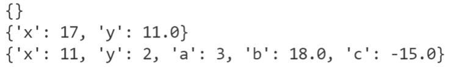
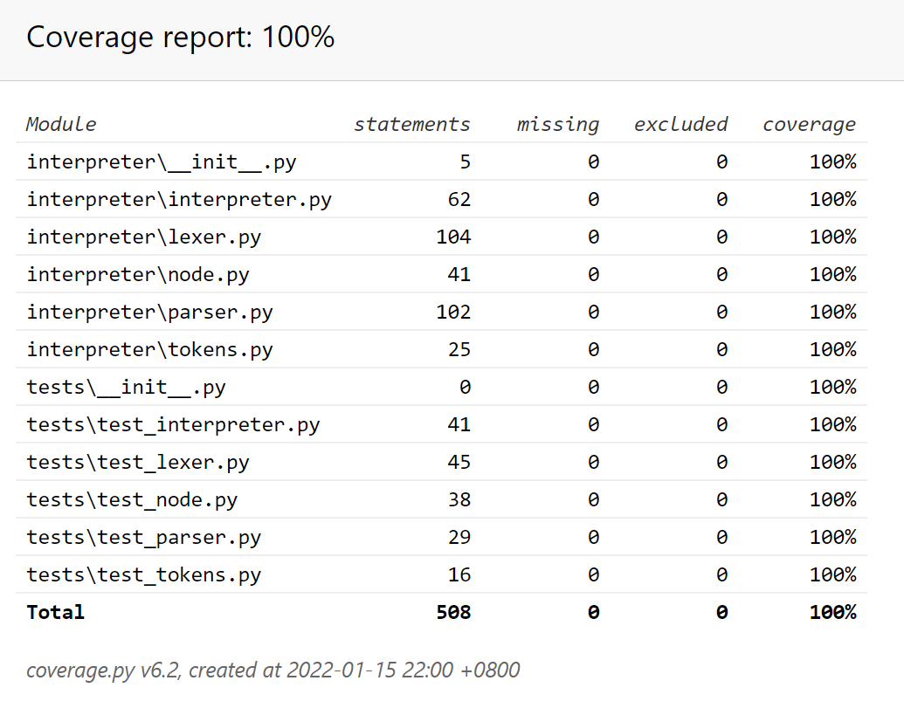

# pascal-interpreter
## Данная программа является очень упрощённым интерпретатором языка Pascal.
На вход подаётся код в формате:<br>
***begin<br>
<assignment|complex statement|empty><br>
end.***<br>
Выходом является словарь (Python dict) со всеми переменными. Key - переменная, value - её значение.

Пример работы программы(main.py):
```python
from interpreter import Interpreter
from interpreter import Parser
import interpreter

if __name__ == "__main__":

    texts = [
    '''
    BEGIN 
    END.
    '''
    ,
    '''
    BEGIN
        x:= 2 + 3 * (2 + 3);
        y:= 2 / 2 - 2 + 3 * ((1 + 1) + (1 + 1));
    END.
    '''
    ,
    '''
    BEGIN
        y := 2;
        BEGIN
            a := 3;
            a := a;
            b := 10 + a + 10 * y / 4;
            c := a - b
        END;
        x := 11;
    END.
    ''']

    parser = Parser()
    interpreter = Interpreter()

    for text in texts:
        result = interpreter(parser(text))
        print(result)
```
Вывод:


Coverage:

